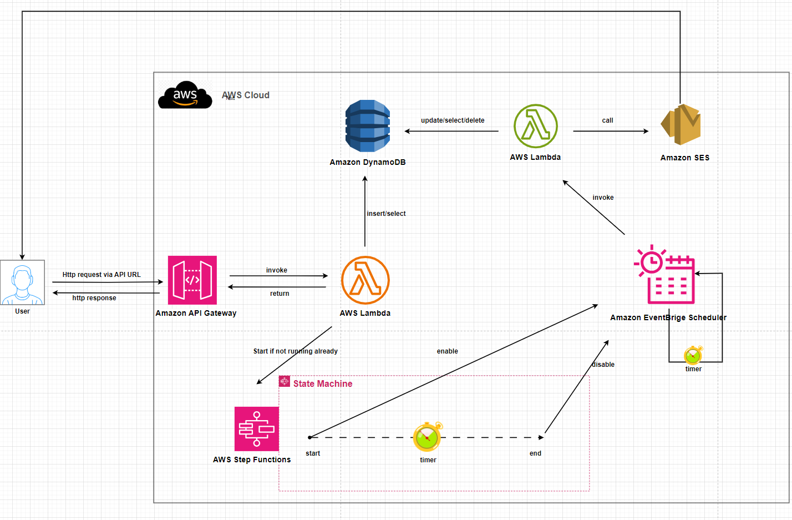
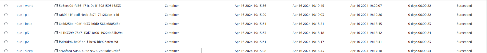
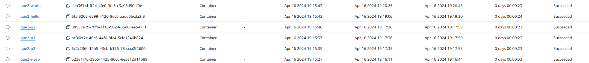
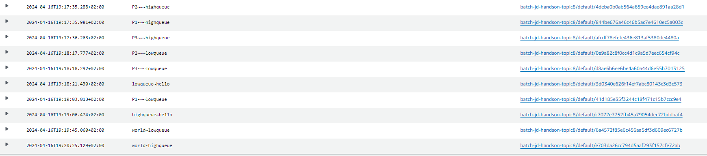

# Topic 8 - Scheduler batch job application(Batch)
## Yuanchao Hands-on Project

## This readme is more readable [here](https://github.com/lyc-handson-aws/handson-topic8)

## **Overview**

**Project's main features**
:point_right: A batch application with 2 different priorities/compute reservation canal, in each canal, the jobs can also have different priorities

## What could be learned in this topic

1. How to define AWS Batch resources: ComputeEnvironment, JobQueue, SchedulingPolicy, and JobDefinition
2. How to launch jobs with dependencies and manage priorities and compute reservations

## **Architecture**
the diagram below illustrates the architecture(test scenario) of this project:

## **Test Scenario**

Check the bash script about this [scenario](https://github.com/lyc-handson-aws/handson-topic8/blob/master/project.sh)

> every time only 3 jobs can run in parallel: all jobs in a compute environment with a maximum 3G CPU, each job consume 1G CPU(one same job definition)

6 jobs submitted(1 second between each job ) to low priority job queue(10 compute reservation)

6 jobs submitted(1 second between each job ) to high priority job queue(30 compute reservation)

in each job queue: 

the first submitted job is a a 'sleep 10' job with priority 4

than it's 2th/3rd/4th job with a incremental priority 1->2->3

the last 2 submitted jobs 's priority is 4 and will print one: "hello" another: "world"

Here is the result 'start time' of jobs in low priority job queue

Here is the result 'start time'  of the jobs in high priority job queue

Here is the result 'start time'  of all jobs 

## Continue Deployment
CloudFormation stack's deployment: see GitHub workflows https://github.com/lyc-handson-aws/handson-topic8/blob/master/.github/workflows/action-cf.yaml

## **CloudFormation Stack Quick-create Link**
Click here to quickly create a same project with the same AWS resources:  [here](https://eu-west-3.console.aws.amazon.com/cloudformation/home?region=eu-west-3#/stacks/create/review?templateURL=https://s3bucket-handson-topic1.s3.eu-west-3.amazonaws.com/CF-template-handson-topic8.yaml)

**See Stack's description for complete actions to reproduce the same project**

> the default stack's region "Europe (Paris) eu-west-3"

## **AWS Resources**
Project's AWS resources:

:point_right: AWS::Batch
- AWS::Batch::ComputeEnvironment - define a API type RESTful
- AWS::Batch::SchedulingPolicy - define a API resource : path, type 
- AWS::Batch::JobQueue - define 2 methods for our API resource: Get,Post
- AWS::Batch::JobDefinition - define API's stages, one can have multiple stages. here we have only one stage: PROD