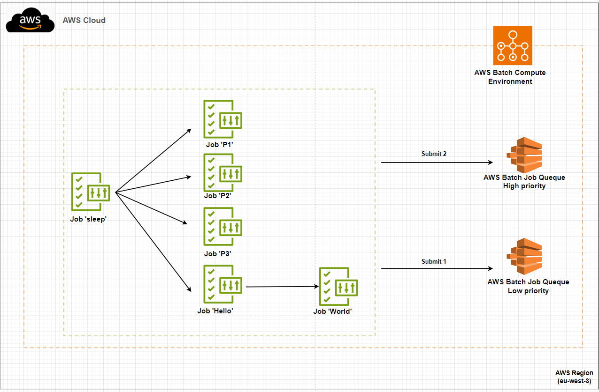

# Topic 7 - Scheduler application to run jobs(Batch)
## Yuanchao Hands-on Project

## This readme is more readable [here](https://github.com/lyc-handson-aws/handson-topic8)

## **Overview**

**Project's main features**
:point_right: A RESTful application "Pets storage shop"

:point_right: people can store their pet in this shop, by providing foods for their pets

 :point_right: when people give their pet to shop, they need to indicate:

## **Architecture**
the diagram below illustrates the architecture(principle) of this project:

## Continue Deployment
CloudFormation stack's deployment: see GitHub workflows https://github.com/lyc-handson-aws/handson-topic8/blob/master/.github/workflows/action-cf.yaml

## **CloudFormation Stack Quick-create Link**
Click here to quickly create a same project with the same AWS resources:  [here](https://eu-west-3.console.aws.amazon.com/cloudformation/home?region=eu-west-3#/stacks/create/review?templateURL=https://s3bucket-handson-topic1.s3.eu-west-3.amazonaws.com/CF-template-handson-topic8.yaml)
**See Stack's description for complete actions to reproduce the same project**

There

> the default stack's region "Europe (Paris) eu-west-3"

## **AWS Resources**
Project's AWS resources:

:point_right: AWS::Batch
- AWS::Batch::ComputeEnvironment - define a API type RESTful
- AWS::Batch::SchedulingPolicy - define a API resource : path, type 
- AWS::Batch::JobQueue - define 2 methods for our API resource: Get,Post
- AWS::Batch::JobDefinition - define API's stages, one can have multiple stages. here we have only one stage: PROD